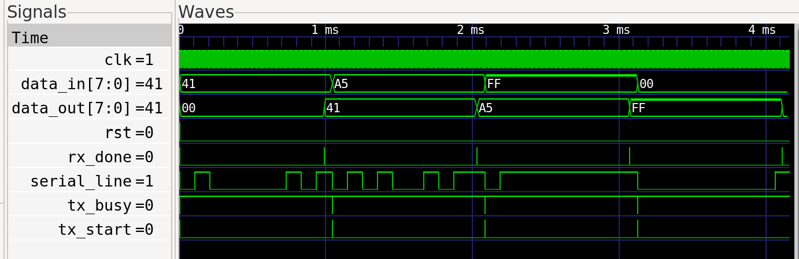

# UART Transceiver in Verilog

A parameterized UART transmitter and receiver, implemented as FSM + shift-register
Verilog modules, verified with a self-checking loopback testbench in Icarus Verilog.

## Frame Format
- 1 start bit (0)
- 8 data bits, LSB first
- 1 stop bit (1)
- No parity

## Architecture
                    ┌─────────────┐
                    │  baud_gen   │
                    │(clk divider)│
                    └──────┬──────┘
                           │ tick (16x baud rate)
              ┌────────────┼────────────┐
              ▼                         ▼
       ┌─────────────┐           ┌─────────────┐
       │  uart_tx    │           │  uart_rx    │
       │  (FSM +     │  serial   │  (FSM +     │
       │  shift reg) ├─────────► │  shift reg) │
       └─────────────┘  loopback └─────────────┘
              ▲                         │
              │                         ▼
         tx_start, data_in      rx_done, data_out

## Repo Layout
- rtl/ — synthesizable design (baud_gen, uart_tx, uart_rx, uart_top)
- tb/ — testbenches, including a self-checking loopback test
- waveforms/ — GTKWave screenshots
- synth/ — Yosys synthesis report 

## How to Run
    iverilog -o sim_top rtl/baud_gen.v rtl/uart_tx.v rtl/uart_rx.v rtl/uart_top.v tb/uart_top_tb.v
    vvp sim_top
    gtkwave uart_top_tb.vcd

## Verification
Self-checking testbench sends 4 bytes through TX -> loopback -> RX and asserts
byte-for-byte equality, including edge cases (0x00, 0xFF, back-to-back frames):

    PASS: sent 0x41, received 0x41
    PASS: sent 0xa5, received 0xa5
    PASS: sent 0x00, received 0x00
    PASS: sent 0xff, received 0xff
    
    ---- Results: 4 passed, 0 failed ----

## Synthesis
Ran through Yosys for a gate-level sanity check:
## Synthesis Results

Synthesized with Yosys (`synth -top uart_top; stat`) — full design maps cleanly to standard gate-level primitives with 0 problems reported.

### Overall Design Summary

| Metric | Count |
|---|---|
| **Total cells** | **264** |
| **Flip-flops** | **62** |
| Combinational logic cells | 202 |
| Total wires | 214 |
| Wire bits | 305 |

### Per-Module Breakdown

| Module | Cells | Flip-flops | Wires |
|---|---|---|---|
| `baud_gen` | 48 | 10 | 34 |
| `uart_tx` | 92 | 21 | 70 |
| `uart_rx` | 124 | 31 | 101 |
| `uart_top` (wrapper) | 3 | — | 9 |
| **Total** | **264** | **62** | **214** |

### Gate-Level Cell Types (full design)

| Cell Type | Count | Function |
|---|---|---|
| `$_OR_` | 50 | OR gate |
| `$_ANDNOT_` | 74 | AND + inverted input |
| `$_DFFE_PP0P_` | 39 | D flip-flop w/ clock enable |
| `$_NAND_` | 22 | NAND gate |
| `$_DFF_PP0_` | 17 | D flip-flop, async reset-to-0 |
| `$_MUX_` | 11 | 2-to-1 multiplexer |
| `$_ORNOT_` | 11 | OR + inverted input |
| `$_XOR_` | 10 | XOR gate |
| `$_AND_` | 9 | AND gate |
| `$_XNOR_` | 8 | XNOR gate |
| `$_DFF_PP1_` | 6 | D flip-flop, async reset-to-1 |
| `$_NOT_` | 5 | Inverter |
| `$_NOR_` | 2 | NOR gate |

*(Full raw `stat` output available in [`synth/yosys_report.txt`](synth/yosys_report.txt) for reference.)*
